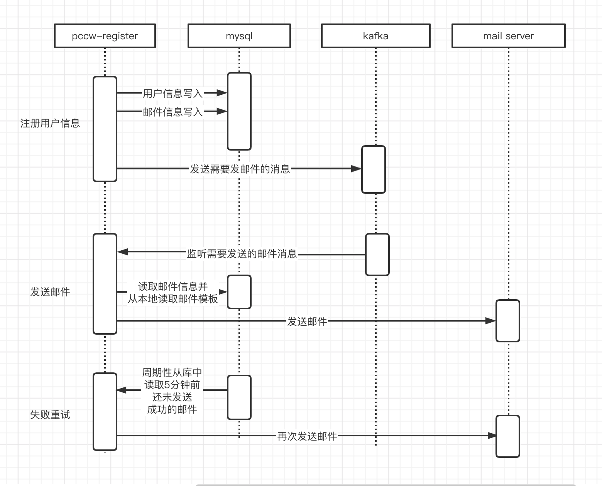

1.运行方式 在根目录下运行 sh run.sh  
2.完成了注册，发邮件，软删除用户，修改用户信息、查看用户信息等操作  
3.如果是本机运行则：  
a.邮箱的地址为 http://127.0.0.1:5080/email   
b.web服务的地址为： http://127.0.0.1:8080/swagger-ui.html   
c.mysql数据库可连接 127.0.0.1:3306    

